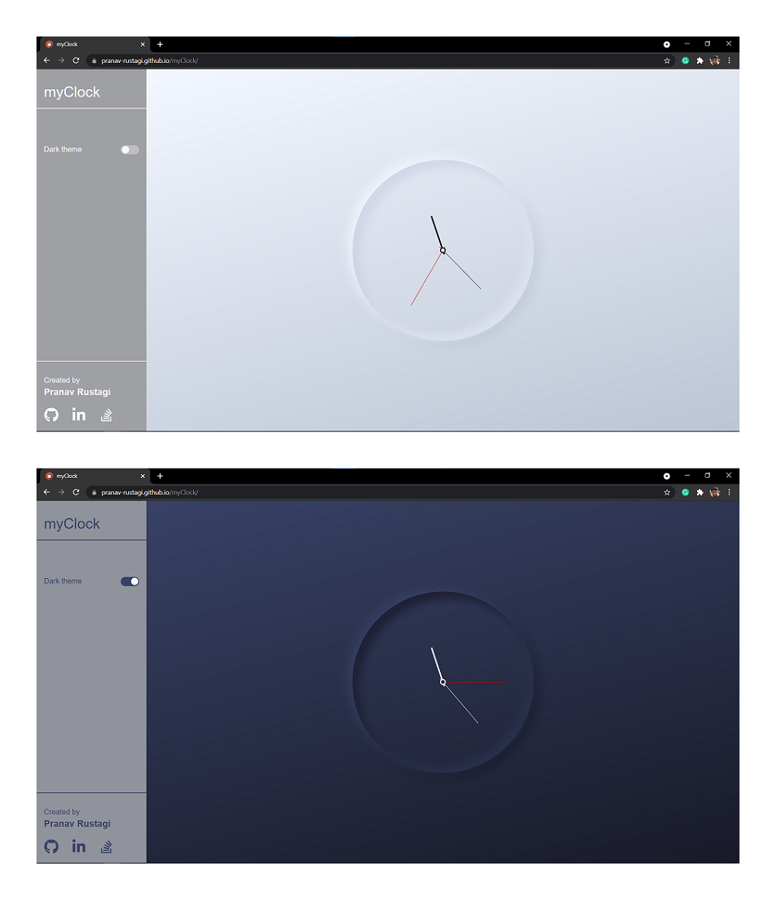
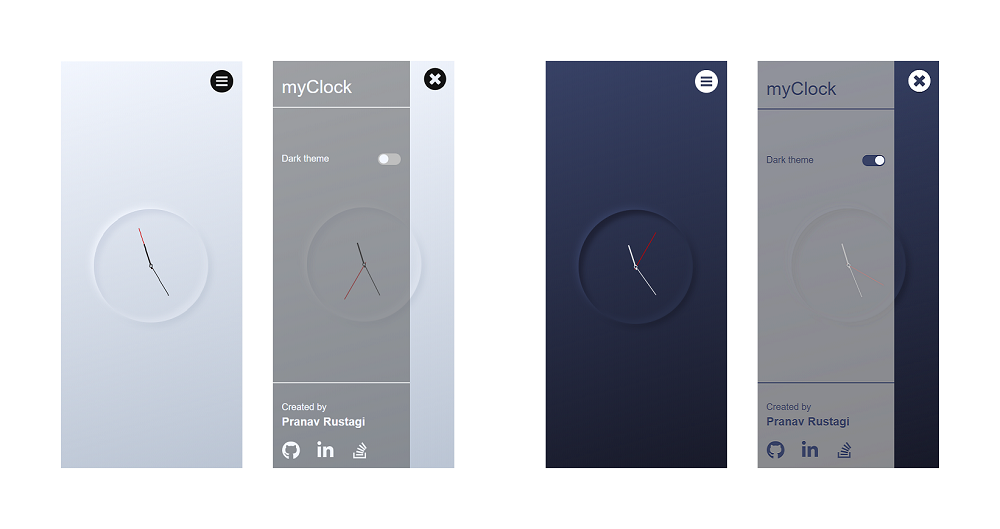
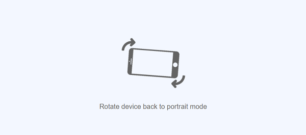

# myClock

## Contents
- [Overview](#overview)
- [UI at different orientations and screen sizes](#screenshots)
- [Features](#features)
- [Skills used](#skills)
- [Links](#links)

 

## Overview
[**_myClock_**](https://pranav-rustagi.github.io/myClock) is a simple functional clock app. It's UI is inspired from a [design post](https://lnkd.in/gkmF5Er) on instagram. 

 

## UI at different orientations and screen sizes

### Desktop View

### Mobile View

#### Portrait Orientation

### Landscape Orientation

 

## Features
- Responsive UI.
- Shows correct time.
- Dark mode availability.
- Checks orientation of device for small width devices and prevents UI from getting distorted in case of lanscape orientation.

 

## Skills used
- HTML
- CSS
- JavaScript

 

## Links
- [Inspiration](https://lnkd.in/gkmF5Er)
- [Live Site URL](https://pranav-rustagi.github.io/myClock)